# Multi-Cloud Landing Zones with Pulumi

This project demonstrates a comprehensive multi-cloud landing zone implementation using Pulumi across AWS, Azure, and Google Cloud Platform (GCP). It follows cloud-native best practices and implements standardized governance, security, and monitoring across all three major cloud providers.

## Architecture Overview

The landing zone architecture implements the following components for each cloud:

### AWS Infrastructure High-Level Design

```mermaid
graph TB
    subgraph "AWS Organization"
        subgraph "Security OU"
            AuditAcc["🔍 Audit Account"]
            LogAcc["📝 Log Archive Account"]
        end
        
        subgraph "Infrastructure OU"
            NetAcc["🌐 Networking Account"]
            SharedAcc["⚙️ Shared Services Account"]
        end
        
        subgraph "Workloads OU"
            ProdAcc["🏭 Production Account"]
            DevAcc["🧪 Development Account"]
        end
    end
    
    subgraph "Shared VPC - 10.0.0.0/16"
        subgraph "Multi-AZ Subnets"
            PubSub["📡 Public Subnets<br/>10.0.1-3.0/24"]
            PrivSub["🔒 Private Subnets<br/>10.0.4-6.0/24"]
        end
        
        IGW["🌍 Internet Gateway"]
        NAT["🔄 NAT Gateways"]
    end
    
    subgraph "Shared Services"
        RAM["📋 AWS RAM<br/>VPC Sharing"]
        Security["🛡️ Security Services<br/>GuardDuty, Config, SecurityHub"]
        Monitoring["📊 Monitoring<br/>CloudTrail, CloudWatch"]
    end
    
    %% Core connections
    NetAcc --> SharedVPC["Shared VPC"]
    SharedVPC --> PubSub
    SharedVPC --> PrivSub
    PubSub --> IGW
    PrivSub --> NAT
    
    %% RAM sharing
    NetAcc --> RAM
    RAM -.-> ProdAcc
    RAM -.-> DevAcc
    
    %% Security services
    Security -.-> AuditAcc
    Monitoring -.-> LogAcc
    
    classDef account fill:#2196F3,stroke:#0D47A1,stroke-width:3px,color:#FFFFFF,font-size:14px,font-weight:bold
    classDef network fill:#4CAF50,stroke:#1B5E20,stroke-width:3px,color:#FFFFFF,font-size:14px,font-weight:bold
    classDef service fill:#FF9800,stroke:#E65100,stroke-width:3px,color:#FFFFFF,font-size:14px,font-weight:bold
    
    class AuditAcc,LogAcc,NetAcc,SharedAcc,ProdAcc,DevAcc account
    class SharedVPC,PubSub,PrivSub,IGW,NAT network
    class RAM,Security,Monitoring service
```



#### Architecture Summary

**Multi-Account Structure:**
- **Security OU**: Audit and log archive accounts for compliance
- **Infrastructure OU**: Networking and shared services accounts
- **Workloads OU**: Production and development accounts for applications

**Shared VPC Model:**
- Single VPC (10.0.0.0/16) owned by networking account
- AWS RAM shares subnets with prod/dev accounts
- Multi-AZ public/private subnets with NAT gateways

**Centralized Services:**
- Security monitoring via GuardDuty, Config, Security Hub
- Centralized logging with CloudTrail and CloudWatch
- Network isolation through security groups and SCPs

### AWS Landing Zone
- **Organization Structure**: AWS Organizations with Security, Infrastructure, Workloads, and Sandbox OUs
- **Core Accounts**: Audit, Log Archive, Shared Services, Networking, Production, and Development accounts
- **Networking**: Shared VPC architecture with centralized networking account owning VPCs and sharing subnets via AWS RAM (Resource Access Manager)
- **VPC Sharing**: Production and development accounts consume shared subnets from the networking account
- **Security**: Service Control Policies (SCPs), AWS Config, CloudTrail, GuardDuty, Security Hub, environment-specific security groups
- **Compliance**: Automated compliance rules and monitoring

### Azure Landing Zone
- **Management Groups**: Hierarchical structure with Platform, Landing Zones, Corp, Online, and Sandbox management groups
- **Subscriptions**: Separate subscriptions for connectivity, management, identity, production, and development
- **Networking**: Hub-spoke architecture with Azure Firewall and VNet peering
- **Security**: Azure Security Center, Defender for Cloud, Policy assignments
- **Governance**: Azure Policy for compliance and governance

### GCP Landing Zone
- **Organization Structure**: Folder hierarchy for Platform, Workloads, and Sandbox environments
- **Projects**: Separate projects for networking, shared services, security, production, and development
- **Networking**: Shared VPC model with centralized networking project
- **Shared VPC Setup**: Manual configuration required (see deployment notes)
- **Security**: Security Command Center, Binary Authorization, Cloud Asset Inventory
- **Compliance**: Organization policies and security monitoring

## Project Structure

```
landing-zones/
├── index.ts                    # Main entry point orchestrating all clouds
├── aws/
│   └── landing-zone.ts         # AWS landing zone component
├── azure/
│   └── landing-zone.ts         # Azure landing zone component
├── gcp/
│   └── landing-zone.ts         # GCP landing zone component
├── shared/
│   ├── monitoring.ts           # Multi-cloud monitoring orchestrator
│   ├── security.ts             # Multi-cloud security orchestrator
│   ├── aws-monitoring.ts       # AWS-specific monitoring
│   ├── azure-monitoring.ts     # Azure-specific monitoring
│   ├── gcp-monitoring.ts       # GCP-specific monitoring
│   ├── aws-security.ts         # AWS-specific security
│   ├── azure-security.ts       # Azure-specific security
│   └── gcp-security.ts         # GCP-specific security
├── package.json
├── Pulumi.yaml
├── Pulumi.dev.yaml             # Configuration file
└── README.md
```

## Prerequisites

1. **Pulumi CLI** installed and configured
2. **Cloud Provider CLI tools**:
   - AWS CLI configured with appropriate permissions
   - Azure CLI logged in with sufficient permissions
   - Google Cloud SDK configured with appropriate permissions
3. **Node.js** and **pnpm** installed
4. **Organizational Permissions**:
   - AWS: Organization master account access
   - Azure: Global administrator or equivalent permissions
   - GCP: Organization administrator permissions

## Configuration

Update `Pulumi.dev.yaml` with your organization details:

```yaml
config:
  aws:region: us-east-1
  azure:location: East US
  gcp:region: us-central1
  landing-zones:orgName: YourOrgName
  landing-zones:aws.enabled: true
  landing-zones:azure.enabled: true
  landing-zones:gcp.enabled: true
```

## Required Permissions

### AWS
- **Existing AWS Organization**: This demo assumes you have an existing AWS Organization
- Organizations full access
- Account creation permissions
- IAM permissions for policy and role creation
- VPC and networking permissions
- CloudTrail, Config, GuardDuty, and Security Hub permissions

### Azure
- Global Administrator or custom role with:
  - Management group creation and modification
  - Subscription creation and management
  - Resource group and resource creation
  - Policy assignment permissions
  - Security Center configuration permissions

### GCP
- **Existing GCP Organization**: This demo assumes you have an existing GCP Organization
- **Billing Account**: Active billing account with billing administrator access
- Organization Administrator role
- Project Creator role
- Folder Admin role
- Security Admin role
- Compute Admin role for networking

## Deployment

1. **Install dependencies**:
   ```bash
   pnpm install
   ```

2. **Configure cloud providers** (ensure all CLIs are authenticated):
   ```bash
   aws configure
   az login
   gcloud auth login
   ```

3. **Set Pulumi configuration**:
   ```bash
   pulumi config set orgName "YourOrgName"
   pulumi config set aws.enabled true
   pulumi config set aws.organizationRootId "r-xxxxxxxxxxxx"  # Your AWS Organization root ID
   pulumi config set azure.enabled true
   pulumi config set gcp.enabled true
   pulumi config set billingAccount "XXXXXX-XXXXXX-XXXXXX"  # Your GCP billing account ID
   ```

   **To find your AWS Organization Root ID:**
   ```bash
   aws organizations list-roots --query 'Roots[0].Id' --output text
   ```

   **To find your GCP Billing Account ID:**
   ```bash
   gcloud billing accounts list --format="value(name)"
   ```

4. **Deploy the landing zones**:
   ```bash
   pulumi up
   ```

5. **Configure GCP Shared VPC (manual step)**:
   After deployment, enable Shared VPC manually:
   ```bash
   # Enable the networking project as a Shared VPC host
   gcloud compute shared-vpc enable [NETWORKING_PROJECT_ID]
   
   # Associate service projects with the host project
   gcloud compute shared-vpc associated-projects add [PROD_PROJECT_ID] --host-project [NETWORKING_PROJECT_ID]
   gcloud compute shared-vpc associated-projects add [DEV_PROJECT_ID] --host-project [NETWORKING_PROJECT_ID]
   ```

6. **View outputs**:
   ```bash
   pulumi stack output
   ```

## Key Features

### Multi-Cloud Governance
- Centralized policy management across all clouds
- Consistent security baselines
- Automated compliance monitoring
- Cost management and optimization

### Security by Design
- Zero-trust network architecture
- Identity and access management integration
- Security monitoring and alerting
- Automated threat detection

### Operational Excellence
- Centralized logging and monitoring
- Multi-cloud dashboards
- Automated backup and disaster recovery
- Infrastructure as Code (IaC) best practices

### Scalability
- Component-based architecture for reusability
- Environment-specific configurations
- Automated resource provisioning
- Cost-optimized resource allocation

## Component Resources

The project uses Pulumi component resources to encapsulate cloud-specific logic:

- `AwsLandingZone`: Complete AWS landing zone with organizations, accounts, and networking
- `AzureLandingZone`: Azure management groups, subscriptions, and hub-spoke networking
- `GcpLandingZone`: GCP folders, projects, and shared VPC architecture
- `MultiCloudMonitoring`: Unified monitoring across all clouds
- `MultiCloudSecurity`: Consistent security policies and monitoring

## Outputs

The deployment provides the following outputs:

```typescript
// AWS outputs
aws.organizationId          // AWS Organization ID
aws.auditAccountId         // Audit account ID
aws.logArchiveAccountId    // Log archive account ID
aws.networkingAccountId    // Networking account ID (owns the shared VPC)
aws.vpcIds                 // Shared VPC ID (same for all environments)
aws.resourceShareArn       // AWS RAM resource share ARN for VPC sharing
aws.securityGroupIds       // Security group IDs by environment

// Azure outputs
azure.managementGroupId    // Root management group ID
azure.platformSubscriptionIds // Platform subscription IDs
azure.vnetIds             // VNet IDs by environment

// GCP outputs
gcp.organizationId         // GCP Organization ID
gcp.folderIds             // Folder IDs by purpose
gcp.projectIds            // Project IDs by environment
gcp.vpcIds                // VPC IDs

// Monitoring outputs
monitoring.dashboardUrls   // Dashboard URLs by cloud
monitoring.alertingEndpoints // Alert endpoints by cloud

// Security outputs
security.aws              // AWS security resource IDs
security.azure            // Azure security resource IDs
security.gcp              // GCP security resource IDs
```

## Customization

To customize the landing zones for your organization:

1. **Modify configuration** in `Pulumi.dev.yaml`
2. **Update component resources** in respective cloud directories
3. **Adjust security policies** in the shared security components
4. **Customize monitoring** dashboards and alerts
5. **Add additional compliance** rules as needed

## Best Practices Implemented

- **Separation of Concerns**: Each cloud provider has its own component
- **Infrastructure as Code**: All resources defined in code
- **Security First**: Security controls implemented from day one
- **Monitoring and Observability**: Comprehensive monitoring setup
- **Cost Management**: Resource tagging and cost allocation
- **Compliance**: Automated compliance monitoring and reporting
- **Disaster Recovery**: Cross-region and cross-cloud resilience

## Troubleshooting

Common issues and solutions:

1. **Permission Errors**: Ensure all required permissions are granted
2. **Quota Limits**: Check cloud provider quotas for organizations/projects
3. **DNS Resolution**: Verify custom domain ownership for organizations
4. **Network Conflicts**: Ensure CIDR blocks don't overlap between clouds

## Contributing

To contribute to this project:

1. Fork the repository
2. Create a feature branch
3. Follow the existing code structure and patterns
4. Test thoroughly across all enabled cloud providers
5. Submit a pull request

## License

This project is licensed under the MIT License - see the LICENSE file for details.